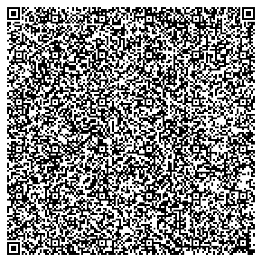
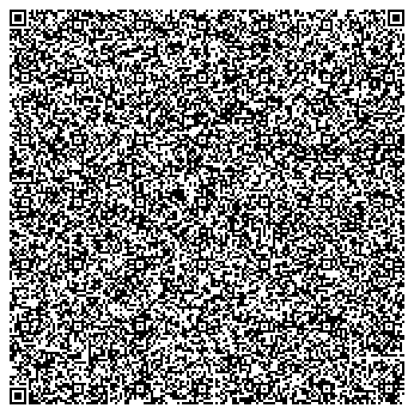

#3C - Consumer Controlled Credit

Consumer Controlled Credit transactions allow consumers to participate in credit transactions without exposing any information to a third party that could be used to harm the consumer. This includes credit card credentials, pins, or any other information that can be used to create credit transactions without the consumer's knowledge.

3C transactions can be used to replace current magstrip and chip-and-pin credit and debit cards. They can be used for online transactions without inviting phishing attacks. In printed form, they can replace paper checks with better security and can be used as self-issued traveler's cheques with the same accptance as debit cards. They could be printed by ATMs, reducing the need for ATMs to store cash. They could also be redeemed at ATMs.

##How it works

In a 3C transaction, a consumer uses their own device -- a smart phone or tablet, for example -- to generate a digital Warrant of Payment that can be redeemed by a specific party for a specific amount of money. The consumer can transfer that Warrant of Payment through a QR Code, a bluetooth connection, an NFC transfer, or any other means without the risk of identity theft. The party receiving the Warrant of Payment can instantly validate it and be confident that they will receive the payment.

###Warrant of Payment

A Warrant of Payment is simply an instruction to the consumer's bank to release a specific amount of money to a specific party. In a 3C transfer, a Warrant of Payment is digitally signed with the consumer's private key and includes the following information:

- Name of bank
- Domain name of bank
- Account number
- Amount of money
- Currency
- Redeemable timestamp
- Name of payee
- Public key of payee
- Digital signature (created using consumer's private key)

When a Warrant of Payment is presented to the bank, the bank can use the public key on file for the consumer's account to validate the digital signature of the Warrant. In this way, the bank can be certain that the Warrant was indeed issued by the account holder.

###Bank Receipt

The bank validates the Warrant and returns a digital receipt that can be used to redeem the Warrant. The receipt contains the following data:

- Domain name of the bank
- Amended Warrant of Payment signed with the bank's private key then encrypted with the payee's public key. It contains the following:
  -   Transaction number
  -   Original Warrant of Payment

The payee can redeem the receipt for payment by presenting it to the bank with the decrypted transaction number. The signature of the Ammended Warrant of Payment can validated against the bank's public key, retrieved from bank's domain name. This gives the payee confidence that the receipt was issued by the bank in question. It also gives the bank confidence that the payee is authorized to redeem the receipt.

##Transaction Examples

### Alice at the Carwash

Alice drives into her favorite carwash and pulls up to the automated teller. She chooses the options she desires and the teller displays a QR code.

Alice points her phone at the QR code and presses the button. Her phone asks her if she wishes to pay the carwash $12, and she answers yes then types in her password. Her phone then displays its own QR code.

Alice shows this code to the teller and presses the teller's Confirm button. The teller verifies the payment and engages the carwash.
